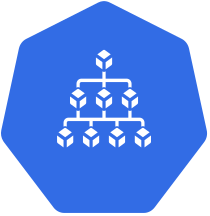
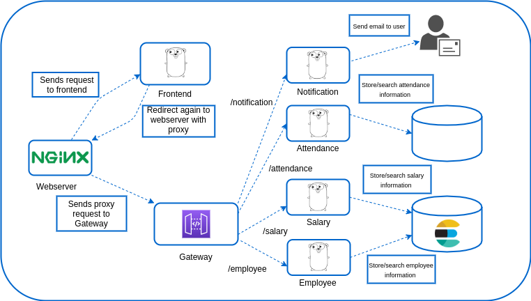
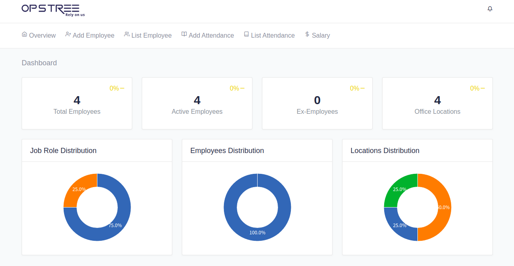

<div align="center">
  
  <h1>OT-Microservices</h1>
</div>

A loaded microservice applications for doing different kinds of POC. This is a sample Employee System which is designed to understand the microservices nature and behaviour.

## Purpose

The purpose of creating this application is to provide an individual, a holistic idea of microservice architecture, it's working, and its setup.

## Applications

These are few microservices which are getting used in this complete project.

| **Application Name**           | **Default Port** | **Dependency**                | **Language**                                                                                                                                          | **Description**                                                                                       |
|--------------------------------|------------------|-------------------------------|-------------------------------------------------------------------------------------------------------------------------------------------------------|-------------------------------------------------------------------------------------------------------|
| [attendance](./attendance)     | 8081             | MySQL                         |                                                                  | Attendance is a microservice which is designed in Golang to manage employee's attendance information. |
| [employee](./employee)         | 8083             | Elasticsearch                 |                                                                    | Employee microservice is also designed in Golang to manage employee's information.                    |
| [salary](./salary)             | 8080             | Elasticsearch                 |                                                                      | Salary is also a golang based application which creates and manages employee's salary information.    |
| [notification](./notification) | -                | SMTP Server                   |  | Notification is a scheduled service which gets used to send mail notifications to employees.          |
| [frontend](./frontend)         | 3000             | attendance, employeee, salary |                                                          | Frontend is written in ReactJS and gets served using proxy.                                           |
| [traefik]()                    | 80               | frontend                      |                                                                    | Webserver is a traefik based proxy which proxies the frontend application.                            |

For further information about the component you can click on the application.

## Databases

These applications are using two kinds of databases, one is structured and other is non-structured.

| **Application Name** | **Default Port** | **Dependency** | **Description**                                                                                               |
|----------------------|------------------|----------------|---------------------------------------------------------------------------------------------------------------|
| [elastic](./elastic) | 9200             | -              | Elasticsearch is being used as non-structured database which manages the employee's information and salary.   |
| [mysql](./mysql)     | 3306             | -              | MySQL is getting used for structured database which manages the employee's attendance information.            |

For further information, click on the DB.

## Architecture

The architecture of the complete microservice interaction looks like this:-

<div align="center">
  
</div>

## Screenshot

<div align="center">
  
</div>

## Quickstart

The quickstart of application can be started using `docker` and `docker-compose`. We can use simple `docker-compose` command to build the images and start the setup.

```shell
# To build the all images of ot-microservices
make build-images

# To start the setup locally
make setup
```

For further details checkout [GETTING_STARTED](./GETTING_STARTED.md)

## Release History

Please see our [CHNANGELOG.md](./CHNANGELOG.md) for details.

## Contact

If you have any suggestion or query. Contact us at

opensource@opstree.com
